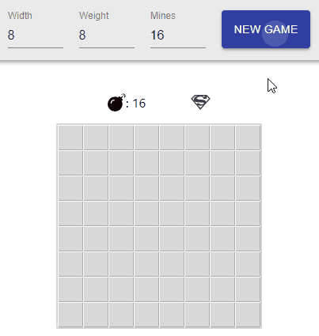

# React Minesweeper

A React version of the Minesweeper game.

## Demo
[Demo](https://shahardav.github.io/react-minesweeper/)


## Development

```
$ git clone https://github.com/shahardav/react-minesweeper.git
$ cd react-minesweeper
$ npm install
$ npm start
```

## Running tests

```
$ cd react-minesweeper
$ npm test
```

## TODO
* Add TypeScript
* Refactor / Improve / Add more tests
* Improve design

## Authors

* **Shahar David** - *Initial work* - [ShaharDav](https://github.com/ShaharDav)


## License

This project is licensed under the [MIT License](http://opensource.org/licenses/MIT)
